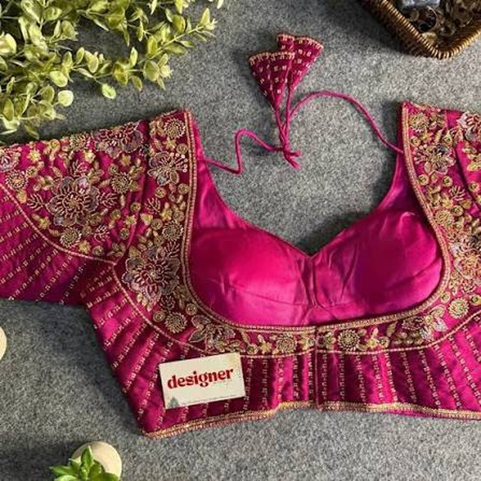
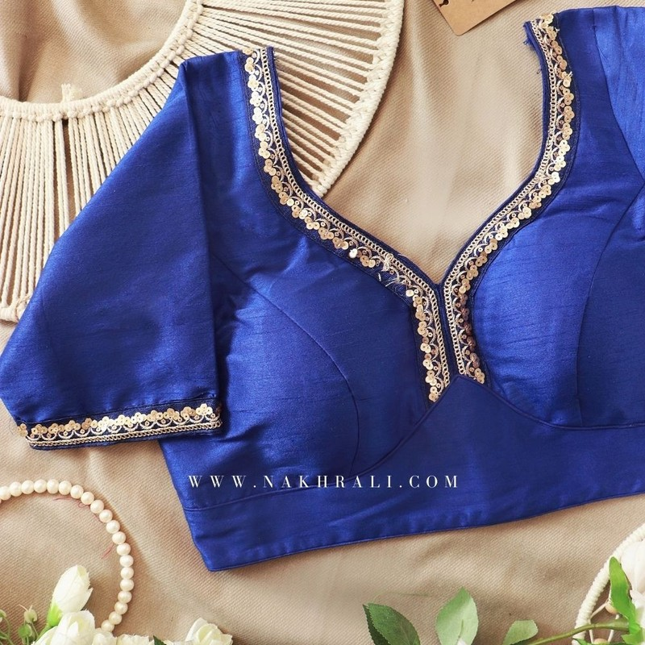
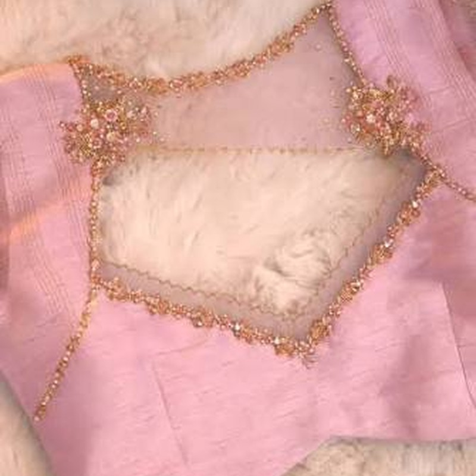
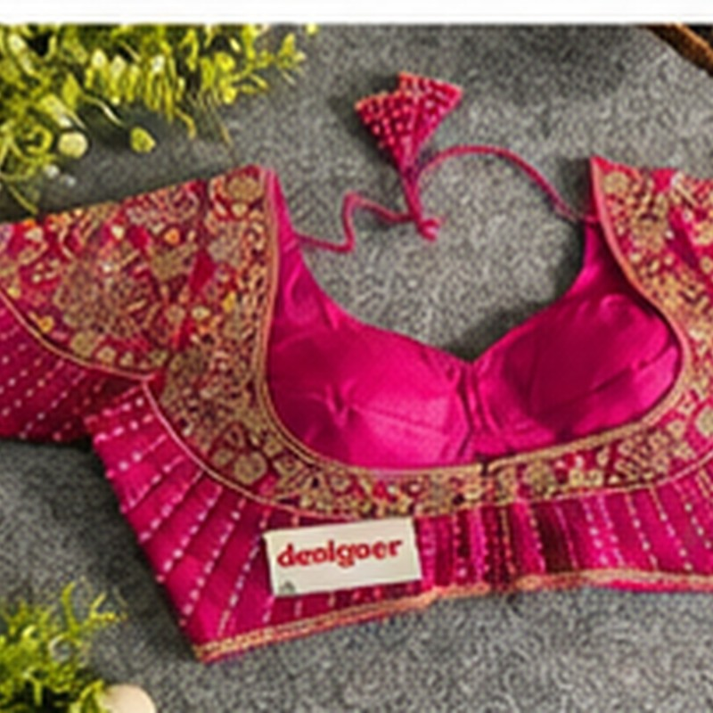
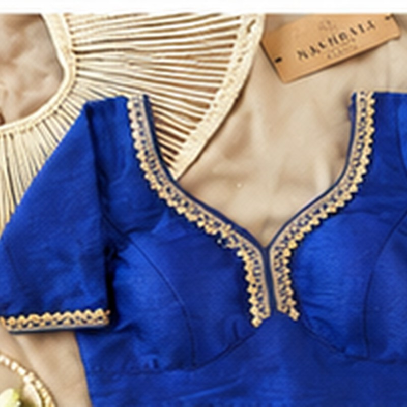
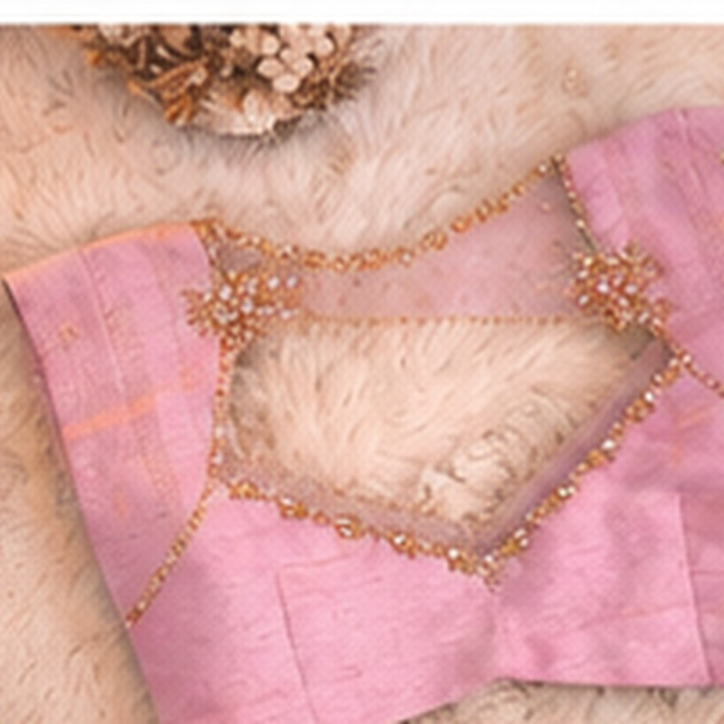

# ✨ GlowWear — Women's Blouses 👗

<p align="center">
  <strong>🌸 A modern boutique-style e-commerce website for Women's Blouses 🌸</strong>
</p>

<p align="center">
  🛍️ Shop &nbsp; • &nbsp; 🔎 Search &nbsp; • &nbsp; ❤️ Wishlist &nbsp; • &nbsp; 🛒 Cart &nbsp; • &nbsp; 👤 Login &nbsp; • &nbsp; 📦 Orders
</p>

---

## 🌷 Project Preview

<p align="center">
  
</p>

> 💖 GlowWear is designed as a clean, elegant and responsive online boutique focused especially on **Women's Blouses**.

---

## 🌟 Features

| Feature | Description |
|---|---|
| 👗 Women's Blouses | Browse a dedicated blouse collection |
| 🔎 Search | Quickly find products |
| 🏷️ Filters | Filter by category and price |
| ⭐ Ratings | Display product ratings |
| ❤️ Wishlist | Save favourite products |
| 🛒 Cart | Add and manage products |
| 👤 Authentication | Login and registration |
| 📦 Orders | Customer order management |
| 🛠️ Admin Panel | Product and store management |
| 💳 Payments | Razorpay / UPI integration ready |
| 🖼️ Product Images | Local images included in the project |
| 📱 Responsive UI | Designed for desktop and mobile screens |
| ⚡ Backend API | Node.js + Express |
| 🗄️ Database Ready | MongoDB / Mongoose architecture |

---

## 🖼️ Product Gallery

### 💎 Designer Blouses

<p align="center">
  
  
  
</p>

### ✨ GlowWear Collection

<p align="center">
  
  
  
</p>

---

## 🧩 Project Structure

```text
GlowWear-Final/
│
├── 📄 README.md
├── 📄 IMAGE_SOURCES.md
├── 📄 .gitignore
│
├── 🎨 frontend/
│   ├── 🏠 index.html
│   ├── 🛍️ shop.html
│   ├── 👗 product.html
│   ├── 🛒 cart.html
│   ├── ❤️ wishlist.html
│   ├── 🔐 login.html
│   ├── 📝 register.html
│   ├── 💳 checkout.html
│   ├── 📦 orders.html
│   ├── 🛠️ admin.html
│   ├── 🎨 css/
│   ├── ⚙️ js/
│   └── 🖼️ assets/
│
└── 🖥️ backend/
    ├── server.js
    ├── package.json
    ├── demoStore.js
    ├── config/
    ├── models/
    ├── routes/
    ├── middleware/
    └── services/
```

---

## 🚀 Run the Project in VS Code

### 1️⃣ Open the project

Open the **GlowWear-Final** folder in VS Code.

### 2️⃣ Open the terminal

```bash
cd backend
```

### 3️⃣ Install dependencies

```bash
npm install
```

### 4️⃣ Start GlowWear

```bash
npm start
```

You should see:

```text
✨ GlowWear running at http://localhost:5050
```

### 5️⃣ Open the website

Open Chrome and visit:

```text
http://localhost:5050/
```

Shop page:

```text
http://localhost:5050/shop.html
```

Health check:

```text
http://localhost:5050/api/health
```

> ⚠️ **Important:** Use port **5050**. Port 5000 can conflict with AirPlay/AirTunes on some Macs.

---

## 🐙 Push GlowWear to GitHub

After changing the project:

```bash
git add .
git commit -m "Update GlowWear"
git push
```

Recommended deployment flow:

```text
💻 VS Code
      ↓
🐙 GitHub
      ↓
☁️ Render
      ↓
🖥️ GlowWear Frontend + Backend
      ↓
🗄️ MongoDB Atlas
      ↓
💳 Razorpay
```

---

## ☁️ Online Deployment

For an online production website:

### GitHub
📦 Stores the project source code.

### Render
🚀 Runs the Node.js + Express backend and serves the frontend.

### MongoDB Atlas
🗄️ Stores users, products and orders.

### Razorpay
💳 Handles online payments / UPI.

---

## 🗄️ MongoDB Configuration

The project is ready for MongoDB.

Add your connection string as an environment variable:

```env
MONGODB_URI=your_mongodb_connection_string
```

⚠️ **Never upload your real `.env` file or database password to GitHub.**

---

## 💳 Razorpay Configuration

The backend contains Razorpay integration support.

For production:

- 🧪 Test using Razorpay Test Mode first
- 🔐 Keep secret keys on the backend
- ✅ Verify payment signatures server-side
- 🌐 Use HTTPS
- 🔔 Configure payment webhooks
- 📦 Verify order/payment reconciliation

---

## 📱 Responsive Design

GlowWear is designed to work across:

```text
💻 Desktop
📱 Mobile
📲 Tablet
🌐 Modern Web Browsers
```

The interface adapts according to the screen size.

---

## 🎯 Main Pages

```text
🏠 Home
   ↓
🛍️ Shop
   ↓
👗 Product Details
   ↓
🛒 Cart
   ↓
💳 Checkout
   ↓
📦 Orders
```

Additional pages:

```text
❤️ Wishlist
👤 Login
📝 Register
🛠️ Admin
```

---

## 🛠️ Technology Stack

### 🎨 Frontend

- HTML5
- CSS3
- JavaScript
- Responsive UI

### 🖥️ Backend

- Node.js
- Express.js
- JWT Authentication
- Mongoose
- MongoDB
- Razorpay

### ☁️ Deployment

- GitHub
- Render
- MongoDB Atlas
- Razorpay

---

## 🖼️ Image Assets

Product images are stored locally in:

```text
frontend/assets/
```

This allows the demo catalog to work without depending on an external image URL.

Image/source information:

```text
IMAGE_SOURCES.md
```

---

## 🔐 Security Notes

Before launching publicly:

- 🔒 Use strong JWT secrets
- 🔑 Store secrets only in environment variables
- 🚫 Never commit `.env`
- 🌐 Enable HTTPS
- 🛡️ Add API validation and rate limiting
- 💳 Verify Razorpay payments server-side
- 💾 Configure database backups

---

## 🌸 GlowWear Vision

> **Discover your style. Wear your confidence. 💖**

GlowWear brings beautiful blouse collections into one simple, modern shopping experience.

From discovering a blouse 👗 to saving it ❤️, adding it to the cart 🛒 and completing checkout 💳 — everything is designed to feel simple and elegant.

---

## 👩‍💻 Developer

### Divya Lagudu

🌷 **GlowWear — Women's Blouses**

---

## ⭐ Support the Project

If you like this project:

⭐ Star the GitHub repository  
🍴 Fork the project  
💡 Suggest improvements  
🐛 Report issues

---

<p align="center">
  <strong>✨ Made with 💖 for fashion lovers ✨</strong>
</p>
